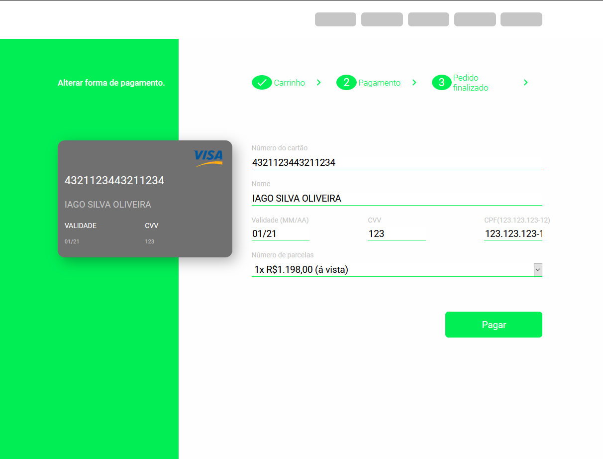

<h1 align="center">
 
 
  Página de checkout
</h1>

Página de pagamento com cartão de crédito

  
  

## Tecnologias
Tecnologias usadas no projeto.
- ⚛️ **ReactJS**

## Começando

1. Clone o repositório `git clone https://github.com/Iago-s/frontend-test.git`
2. Vá para a pasta criada `cd frontend-test`
3. Instale as dependências `npm install`
4. Execute o projeto `npm start`
